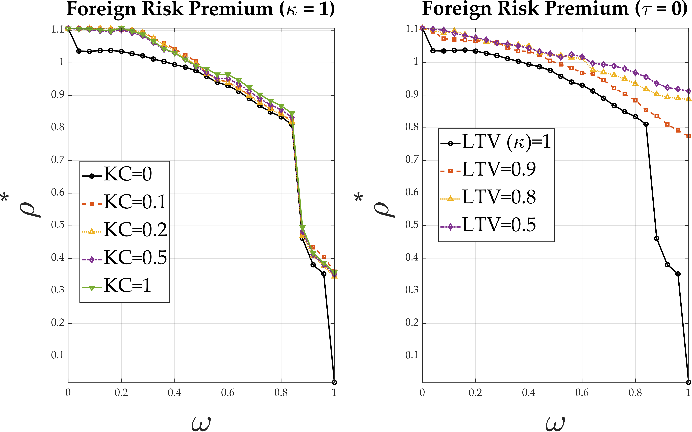
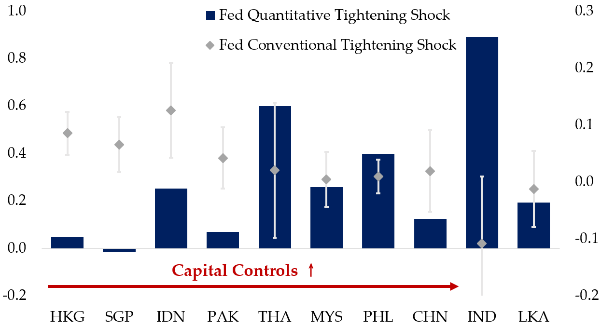
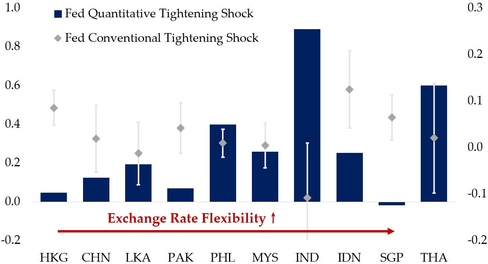
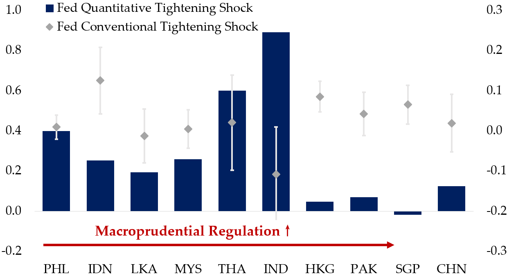

## *\* My name is pronounced as if you're sneezing —— 'Hǎi Qín!'*

I am a candidate in the Elite PhD Program in Economics at [Fudan University](https://www.fudan.edu.cn/en/). I obtained my Bachelor’s degree in Mathematical Economics from Fudan in 2021, with a second major in Data Science. I currently work as a Consultant at the World Bank Group. 

## Research fields

**Primary**: International Finance & Macroeconomics; **Secondary**: Monetary Policy, Uncertainty

<!-- Mi hermanita [Haihan Liu](https://github.com/GraceHanLiu) studies Statistics at [Shanghai University of Finance and Economics](https://english.sufe.edu.cn/) and contributes part-time to my research under my mentorship. -->

I research nonlinear interactions between international policy regimes and multidimensional monetary policy spillovers.

Numerical examples from a two-country monetary model with collateral constraints show that macroprudential policy is a more robust buffer than capital controls:

Representative examples from Asian economies:
$$
\Delta \ln({\rm Spread})_{c,s,\tau}=\textcolor{magenta}{\boldsymbol{\beta}^c_1}\,u_{1,\tau} + \textcolor{blue}{\boldsymbol{\beta}^c_2}\,u_{3,\tau} + \alpha^c_s+\varepsilon_{c,s,\tau}. \text{ EMBI spread; CDS for HKG and SGP.}
$$

 

